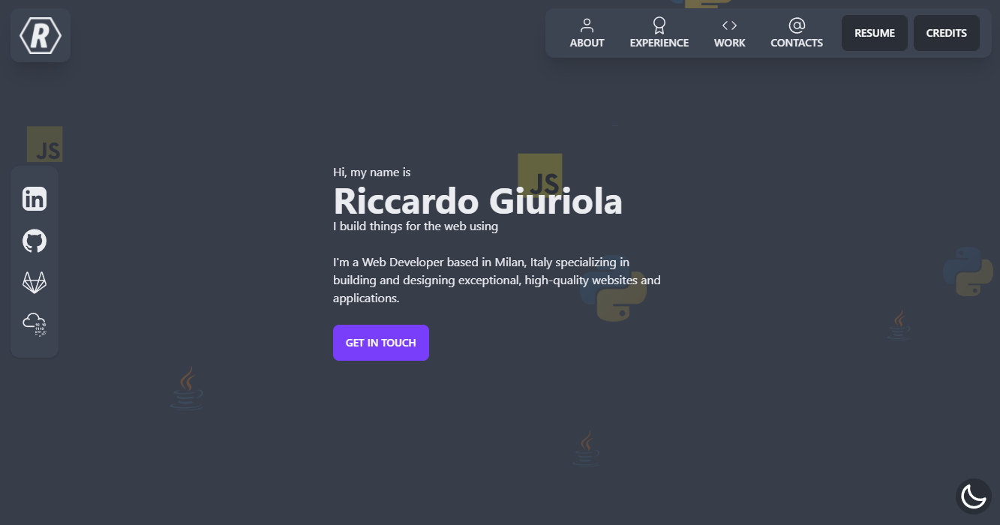

<h1 align="center">Welcome to MyPortfolio 👋</h1>
<p>
  
</p>

> Riccardo Giuriola personal portfolio

### 🏠 [Homepage](https://riccardogiuriola.it)



## Install

```sh
yarn install
```

## Usage

```sh
yarn run start
```

## Author

👤 **Riccardo Giuriola**

* Website: https://riccardogiuriola.it
* Github: [@riccardogiuriola](https://github.com/riccardogiuriola)
* LinkedIn: [@riccardo-giuriola-67825715b](https://linkedin.com/in/riccardo-giuriola-67825715b)

## Show your support

Give a ⭐️ if this project helped you!

***
_This README was generated with ❤️ by [readme-md-generator](https://github.com/kefranabg/readme-md-generator)_